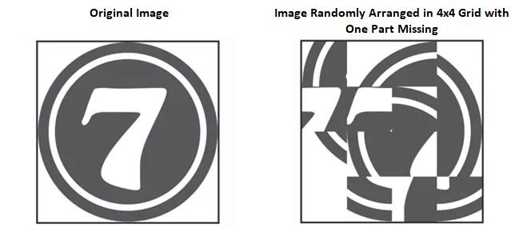

# README #

The 15-Game is a sliding puzzle (i.e., a puzzle in which the player slides the pieces of the puzzle) that consists of an image divided into 16 parts of equal dimensions randomly arranged in a 4x4 grid. The last part of the image is omitted so that there is an empty space where the player can slide the parts of the image. The goal of the 15-Game is to solve the puzzle (i.e., to place the parts of the image in order) by making sliding moves that use the empty space. An image of 15-game follows:

## Fixing issues ##

Create a commit (or more commits, if needed) to fix each issue. Remember to mention, in the commit message, the issue you are working on -- each issue has an ID.